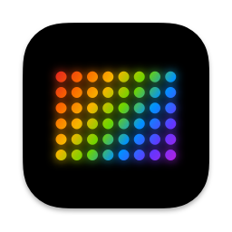

<p align="center">

</p>

<h1 align="center">Beacon</h1>

<p align="center">
A macOS app for controlling Neewer LED lights via Bluetooth, with Stream Deck+ integration.
</p>

# About

Beacon is a macOS app that lets you control Bluetooth-enabled Neewer LED lights from your Mac. It features a modern SwiftUI interface with full support for CCT, HSI, FX effects, and light source modes, plus a Stream Deck+ plugin for hardware control.

Originally forked from [keefo/NeewerLite](https://github.com/keefo/NeewerLite) by [Xu Lian](https://github.com/keefo), Beacon has been substantially rewritten with a new SwiftUI interface, 13+ bug fixes, expanded light database, and a complete Stream Deck+ plugin overhaul.

# Features

- **SwiftUI interface** with gradient sliders, color wheel, and card-based light management
- **CCT mode** — brightness, color temperature, and green-magenta control
- **HSI mode** — full RGB color wheel with hue, saturation, and brightness
- **FX mode** — 17 lighting effects with speed, brightness, CCT, and color controls
- **Light Source mode** — preset light source emulations (tungsten, daylight, etc.)
- **Stream Deck+ plugin** — 16 actions including dials for brightness, temperature, GM, FX speed, and keys for mode switching, FX cycling, source cycling
- **73 light types** supported with full command patterns
- **URL scheme commands** for automation and Shortcuts integration
- **Audio-reactive mode** — sync lights to music

# Requirements

- macOS 14.0 (Sonoma) or later
- Xcode 15+ to build
- Bluetooth-enabled Neewer LED light

# How to Build

1. Clone this repo
2. Open `NeewerLite/NeewerLite.xcodeproj` in Xcode
3. Select the **NeewerLite** scheme, set destination to **My Mac**
4. Build & Run (Cmd+R)
5. The app appears in your menu bar (not the Dock)

## Stream Deck Plugin

```bash
cd NeewerLiteStreamDeck/neewerlite
npm install
npm run build
cp -r com.beyondcow.neewerlite.sdPlugin ~/Library/Application\ Support/com.elgato.StreamDeck/Plugins/
```

Restart the Stream Deck app to load the new actions.

# Stream Deck+ Actions

## Dials
| Action | Description |
|--------|-------------|
| **Brightness** | Rotate to adjust brightness, press to toggle power |
| **Temperature** | Rotate to adjust CCT, press to toggle power |
| **GM** | Rotate to adjust green-magenta tint (-50 to +50) |
| **HUE** | Rotate to adjust hue (0-360), press to toggle power |
| **Saturation** | Rotate to adjust saturation, press to toggle power |
| **FX Speed** | Rotate to adjust effect speed (1-10) |

## Keys
| Action | Description |
|--------|-------------|
| **On/Off** | Toggle light power |
| **CCT Mode** | Switch to CCT mode |
| **HSI Mode** | Switch to HSI color mode |
| **FX Cycle** | Cycle through effects, shows current name |
| **Source Cycle** | Cycle through light sources |
| **Brightness Key** | Set brightness to preset value |
| **Temperature Key** | Set temperature to preset value |
| **CCT Key** | Set brightness + temperature combo |
| **HST Key** | Set hue + saturation + brightness |
| **FX Key** | Activate specific effect |

# Script Commands

```bash
# Power
open "neewerlite://turnOnLight"
open "neewerlite://turnOffLight"
open "neewerlite://toggleLight"

# Scan
open "neewerlite://scanLight"

# CCT mode
open "neewerlite://setLightCCT?CCT=3200&Brightness=100"
open "neewerlite://setLightCCT?CCT=3200&GM=-50&Brightness=100"

# HSI mode
open "neewerlite://setLightHSI?RGB=ff00ff&Saturation=100&Brightness=100"
open "neewerlite://setLightHSI?HUE=360&Saturation=100&Brightness=100"

# Scenes
open "neewerlite://setLightScene?SceneId=1&Brightness=100"

# Target specific light
open "neewerlite://turnOnLight?light=MyLight"
```

# Tested Lights

- Neewer CB100C (type 49) — fully tested, all modes
- Neewer RGB1200 III (type 87) — power working, CCT/HSI in progress
- Neewer CB60 RGB (type 22) — basic functionality

# What Still Needs Work

- [ ] Fix MAC address discovery on macOS Sonoma/Sequoia (system_profiler format changed)
- [ ] Finish RGB1200 III protocol support (MAC-embedded CCT/HSI commands)
- [ ] Extract BLE management from AppDelegate into standalone manager
- [ ] Delete remaining old AppKit view files (~3,000 lines of dead code)
- [ ] SwiftUI log monitor
- [ ] SwiftUI pattern editor
- [ ] Audio spectrogram in SwiftUI

# Credits

- **Original NeewerLite app** — [Xu Lian (keefo)](https://github.com/keefo/NeewerLite). All credit for the BLE protocol reverse-engineering and command pattern system. Please consider [sponsoring his work](https://github.com/sponsors/keefo).
- **Beacon** — [TheASDM](https://github.com/TheASDM)
- **Bug fixes, SwiftUI rewrite, Stream Deck overhaul, and database expansion** — Built with [Claude Code](https://claude.ai/claude-code)

# License

MIT License — see [LICENSE](LICENSE) for details.
